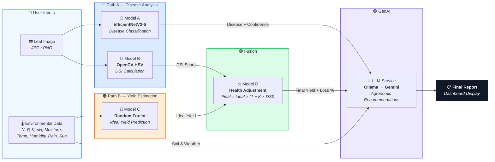

# 🌽 AgroPredict — AI-Driven Maize Disease Diagnostics & Yield Estimation

AgroPredict is an end-to-end agricultural intelligence system that combines **computer vision**, **machine learning**, and **generative AI** to help maize farmers diagnose crop diseases, predict yield losses, and receive actionable agronomic recommendations — all from a single leaf image and environmental sensor data.

---

## ✨ Key Features

- **Disease Detection** — EfficientNetV2-S CNN classifies 7 maize diseases from a leaf photo
- **Severity Quantification** — OpenCV HSV segmentation calculates Disease Severity Index (DSI)
- **Yield Prediction** — Random Forest model estimates optimal yield from 9 soil & weather features
- **Health-Adjusted Yield** — Combines DSI with yield prediction: `Final = Ideal × (1 − K × DSI)`
- **AI Agronomist** — LLM generates tailored treatment & recovery recommendations
- **Interactive Dashboard** — Clean, responsive web UI with real-time API integration
- **Dual LLM Backend** — Falls back from local Ollama to cloud Gemini automatically

---

## 🏗️ System Architecture



---

## 📁 Project Structure

```
Model_A/
├── main.py                  # FastAPI backend — orchestrates the full pipeline
├── schemas.py               # Pydantic request/response models
├── model_a.py               # Model A — EfficientNetV2-S disease classifier + Model B (DSI)
├── model_cRF.py             # Model C — Random Forest yield predictor + Model D (adjustment)
├── llm_service.py           # LLM service — Ollama (local) → Gemini (cloud) fallback
├── augment_data.py          # Synthetic data augmentation for Model C training
│
├── index.html               # Frontend dashboard (served at /)
├── data_flow.html           # Interactive system architecture diagram (served at /data_flow)
│
├── model_a_weights.pth      # Trained CNN weights (~80 MB)
├── model_cRF_weights.pkl    # Trained Random Forest weights (~50 MB)
├── model_cRF_scaler.pkl     # Feature scaler for Model C
├── model_cRF_config.json    # Model C training metadata
├── class_names.txt          # Disease class labels
│
├── yield-predict.csv        # Original maize yield dataset (1,659 rows)
├── yield-predict-augmented.csv  # Augmented dataset (~8,000 rows)
├── crop-yield.csv           # Source multi-crop dataset
│
├── evaluate/                # Evaluation scripts and results
│   ├── evaluate_model_a.py  # Confusion matrix & classification report
│   ├── evaluate_model_c.py  # R², MAE, feature importance plots
│   └── *.png / *.txt        # Generated reports and charts
│
├── requirements.txt         # Python dependencies
├── .gitignore
└── README.md
```

---

## 🚀 Quick Start

### Prerequisites

- Python 3.10+
- (Optional) [Ollama](https://ollama.ai/) for local LLM inference
- (Optional) Google Gemini API key for cloud LLM fallback

### 1. Clone & Setup

```bash
git clone <your-repo-url>
cd "Model_A"

# Create virtual environment
python -m venv venv

# Activate it
# Windows:
.\venv\Scripts\activate
# Linux/Mac:
source venv/bin/activate

# Install dependencies
pip install -r requirements.txt
```

### 2. (Optional) Setup LLM

**Option A — Local Ollama (free, private):**
```bash
# Install Ollama from https://ollama.ai
ollama pull llama3.2
ollama serve
```

**Option B — Cloud Gemini (needs API key):**
```bash
# Get your key from https://aistudio.google.com/apikey
# Windows:
set GEMINI_API_KEY=your_key_here
# Linux/Mac:
export GEMINI_API_KEY=your_key_here
```

> The system tries Ollama first, falls back to Gemini automatically.

### 3. Run the Server

```bash
python main.py
```

Open **http://localhost:8000** in your browser.

---

## 📡 API Reference

### `GET /health`
Health check — confirms which models are loaded.

**Response:**
```json
{
  "status": "online",
  "models": {
    "model_a": true,
    "model_cRF": true
  }
}
```

### `POST /analyze`
Full pipeline analysis — upload a leaf image + environmental data.

**Request:** `multipart/form-data`
| Field | Type | Description |
|-------|------|-------------|
| `image` | File | Leaf photo (JPG/PNG, max 10 MB) |
| `env_data` | JSON string | Environmental parameters |

**`env_data` JSON format:**
```json
{
  "n": 80, "p": 45, "k": 60,
  "soil_ph": 6.5,
  "soil_moisture": 25.0,
  "temperature": 26,
  "humidity": 60,
  "rainfall": 900,
  "sunlight_hours": 8
}
```

**Response:**
```json
{
  "disease_report": {
    "disease_name": "Common Rust",
    "confidence_score": 0.95,
    "dsi": 0.42,
    "affected_area_percent": 42.0,
    "severity": "Moderate"
  },
  "yield_report": {
    "ideal_yield": 10.5,
    "final_yield": 7.86,
    "yield_loss": 2.64,
    "yield_loss_percentage": 25.2,
    "dsi_used": 0.42,
    "crop_sensitivity_K": 0.6
  },
  "ai_recommendation": {
    "status": "success",
    "model_used": "llama3.2 (Ollama - Local)",
    "recommendation": "..."
  }
}
```

### `GET /data_flow`
Interactive animated diagram showing the system architecture.

---

## 🧠 Models

### Model A — Disease Classifier
| Property | Value |
|----------|-------|
| Architecture | EfficientNetV2-S (fine-tuned) |
| Input | 224×224 RGB leaf image |
| Classes | Blight, Common Rust, Downy Mildew, Gray Leaf Spot, Healthy, MLN, MSV |
| Dataset | 2,800+ maize leaf images |

### Model B — DSI Calculator
| Property | Value |
|----------|-------|
| Method | OpenCV HSV color-space segmentation |
| Output | Disease Severity Index (0.0 – 1.0) |
| Formula | `DSI = diseased_pixels / total_leaf_pixels` |

### Model C — Yield Predictor
| Property | Value |
|----------|-------|
| Algorithm | Random Forest Regressor (scikit-learn) |
| Features | N, P, K, Soil_pH, Soil_Moisture, Temperature, Humidity, Rainfall, Sunlight_Hours |
| Dataset | ~8,000 rows (augmented from 1,659 maize records) |

### Model D — Health Adjustment
| Property | Value |
|----------|-------|
| Formula | `Final Yield = Ideal Yield × (1 − K × DSI)` |
| K (Maize) | 0.6 (crop sensitivity constant) |

---

## 🌐 Input Validation (Agronomic Bounds)

The dashboard enforces scientifically accurate ranges:

| Field | Min | Max | Rationale |
|-------|-----|-----|-----------|
| Nitrogen (N) | 1 | 300 | Depleted to heavily fertilized soil |
| Phosphorus (P) | 1 | 200 | Typical agricultural range |
| Potassium (K) | 1 | 300 | Typical agricultural range |
| Soil pH | 3.5 | 9.5 | Agricultural soil always in this range |
| Soil Moisture | 5% | 100% | Below 5% = past permanent wilting point |
| Temperature | 5°C | 45°C | Maize germination requires >5°C |
| Humidity | 10% | 100% | 0% RH is physically impossible in ag zones |
| Rainfall | 0 mm | 5000 mm | 0mm is valid (dry spell / irrigation) |
| Sunlight Hours | 1 hr | 16 hrs | Crops need light to produce yield |

---

## 🔧 Retraining Models

### Retrain Model C (Yield Predictor)

```bash
# Step 1: Generate augmented dataset
python augment_data.py

# Step 2: Train Random Forest on augmented data
python model_cRF.py
```

### Evaluate Models

```bash
# Evaluate Model A (disease classifier)
python evaluate/evaluate_model_a.py

# Evaluate Model C (yield predictor)
python evaluate/evaluate_model_c.py
```

---

## 📦 Deployment

### Environment Variables

| Variable | Required | Description |
|----------|----------|-------------|
| `GEMINI_API_KEY` | If no Ollama | Google Gemini API key for cloud LLM |

### Deploy with Uvicorn (Production)

```bash
pip install uvicorn
uvicorn main:app --host 0.0.0.0 --port 8000
```

### Deploy with Docker (Optional)

```dockerfile
FROM python:3.10-slim
WORKDIR /app
COPY requirements.txt .
RUN pip install --no-cache-dir -r requirements.txt
COPY . .
EXPOSE 8000
CMD ["uvicorn", "main:app", "--host", "0.0.0.0", "--port", "8000"]
```

---

## 🛠️ Tech Stack

| Layer | Technology |
|-------|-----------|
| Backend | FastAPI, Uvicorn |
| ML / CV | PyTorch, torchvision, scikit-learn, OpenCV |
| LLM (Local) | Ollama (Llama 3.2) |
| LLM (Cloud) | Google Gemini API (`google-genai`) |
| Frontend | Vanilla HTML/CSS/JS, Inter font |
| Data | Pandas, NumPy |

---

